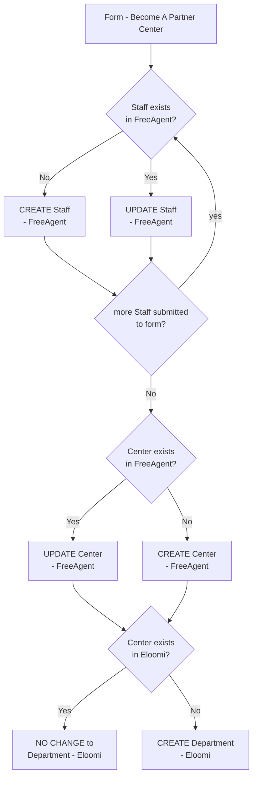

# efs

Educational First Steps

```mermaid
graph TD
    A[Form - Become A Partner Center] --> B{Staff exists\nin FreeAgent?}
    --> |Yes| D[UPDATE Staff\n- FreeAgent]
    B --> |No| C[CREATE Staff \n- FreeAgent]
    C --> E{more Staff submitted\nto form?} --> |yes| B
    D --> E
    E --> |No| F{Center exists\nin FreeAgent?}
    F --> |Yes| G[UPDATE Center\n- FreeAgent]
    F --> |No| H[CREATE Center\n- FreeAgent]
    G --> I{Center exists\nin Eloomi?}
    H --> I
    I --> |Yes| J[NO CHANGE to\nDepartment - Eloomi]
    I --> |No| K[CREATE Department\n- Eloomi]
```
